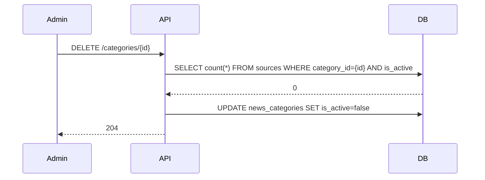
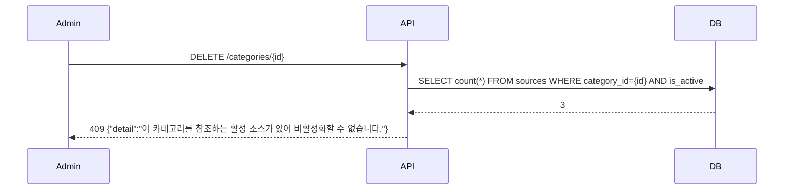

# 기술스펙_카테고리소스스키마

- 기능요청: [#13](https://github.com/MEV-SW/mint-server/issues/13) / 인터페이스 정의: [API스펙_카테고리소스스키마](API스펙_카테고리소스스키마.md)([머지된 PR #16](https://github.com/MEV-SW/mint-server/pull/16))
- 작성: 채윤성 / 승인: 리뷰 없음(2026-09-06 규칙 — 본인이 PR을 올리고 본인이 머지)

## 변경 범위
- `app/models/personalization.py`: `NewsCategory`는 변경 없음(기존 `is_active` 필드 재사용).
- `app/models/source.py`: `Source`에 `category_id` 컬럼 추가.
- `app/schemas/source.py`: `SourceCreate`/`SourceUpdate`/`SourceRead`에 `category_id: UUID | None = None` 추가.
- `app/schemas/personalization.py`: `CategoryUpdate` 스키마 신규 추가(`name`/`sort_order`/`is_active` 전부 선택).
- `app/services/personalization_service.py`(`TaxonomyService`): `update_category`, `deactivate_category` 메서드 추가. `deactivate_category`는 활성 `Source.category_id` 참조 여부를 조회해 있으면 거부한다.
- `app/services/source_service.py`: `create_source`/`update_source`에서 `category_id` 검증(존재·같은 조직·활성) 추가.
- `app/api/v1/personalization.py`: `PATCH`·`DELETE /categories/{category_id}` 라우트 추가.
- `alembic/versions/`: 신규 마이그레이션 `015`(head `014` 다음).
- 프론트(mint-web)·크롤러 워커: 이 카드에서 변경 없음(웹은 W1에서 별도 카드로 소비).

## DB 스키마 변경분
- `sources.category_id UUID NULL REFERENCES news_categories(id)` 추가. 인덱스 `ix_sources_category_id` 추가(참조 소스 존재 여부 조회에 씀).
- 기존 `sources.category`(String)는 변경·삭제하지 않는다 — 컬럼 추가는 nullable 원칙, 하위 호환 유지.
- 마이그레이션 번호: `015_source_category_id.py`(`down_revision = "014"`). 기존 행의 `category_id`는 전부 `NULL`로 시작하고, 이 카드에서 백필하지 않는다(안 만들 것 목록).

## 핵심 흐름 (시퀀스 1-2개)

정상 경로 — 카테고리 비활성화(연결 소스 없음):

실패 경로 — 참조 소스가 있어 거부:

## 외부 의존성
없음 — 이 카드는 mint-server 내부 스키마·API만 변경한다. LLM·외부 서비스 호출 없음. 프론트(mint-web) 소비는 W1(선행 카드로 의존)에서 별도 구현.

## flag
없음. 신규 엔드포인트는 기존과 동일하게 `require_admin`으로만 게이팅되고, `category_id`가 없는 기존 소스·카테고리 응답 형식은 그대로라 별도 기능 플래그가 필요 없다.
