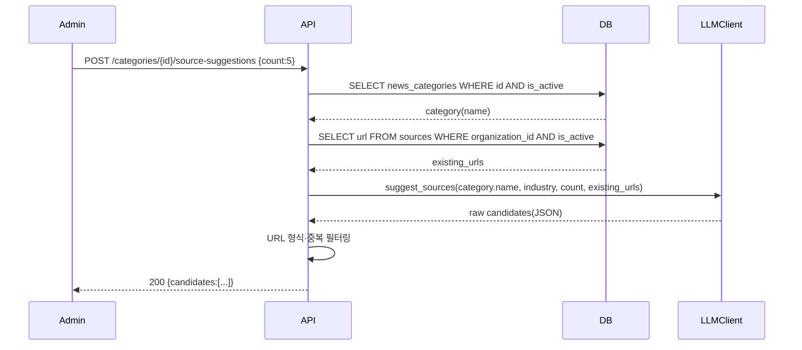
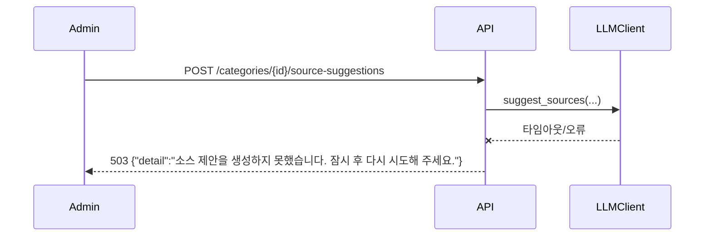

# 기술스펙_AI소스제안

- 기능요청: [#14](https://github.com/MEV-SW/mint-server/issues/14) / 인터페이스 정의: [API스펙_AI소스제안](API스펙_AI소스제안.md)([머지된 PR #19](https://github.com/MEV-SW/mint-server/pull/19))
- 작성: 채윤성 / 승인: 리뷰 없음(2026-09-06 규칙 — 본인이 PR을 올리고 본인이 머지)

## 변경 범위
- `app/services/llm_client.py`: `LLMClient` 추상 클래스에 `suggest_sources(category_name, *, industry, count, existing_urls)` 추가. `BedrockClient`·`GeminiClient`·`MockLLMClient` 3곳 모두 구현(기존 [`get_llm_client()`](https://github.com/MEV-SW/mint-server/blob/main/app/services/llm_client.py) 팩토리가 셋 중 하나를 고르는 기존 방식 그대로 재사용).
- `app/prompts/source_suggest_v1.md`: 신규 프롬프트 파일(기존 [`post_classify_v1.md`](https://github.com/MEV-SW/mint-server/blob/main/app/prompts/post_classify_v1.md) 등과 같은 위치·형식).
- `app/services/source_service.py`: `SourceService.active_urls(organization_id)` 추가 — 같은 조직의 활성 소스 URL 집합을 반환(중복 필터링에 씀).
- `app/api/v1/personalization.py`: `POST /categories/{category_id}/source-suggestions` 라우트 추가. 후보 필터링(URL 형식·중복)은 라우트 핸들러가 아니라 `TaxonomyService`나 별도 작은 함수로 분리한다(라우트는 얇게 유지).
- 프론트(mint-web)·DB: 이 카드에서 변경 없음(웹은 W2에서 별도 카드로 소비, DB는 신규 테이블 없음).

## DB 스키마 변경분
없음 — 인터페이스 정의서에서 정한 대로 결과를 저장하지 않는 stateless 설계다.

## 핵심 흐름 (시퀀스 1-2개)

정상 경로:

실패 경로 — LLM 호출 실패:

## 외부 의존성
- 기존 [`get_llm_client()`](https://github.com/MEV-SW/mint-server/blob/main/app/services/llm_client.py) 팩토리(Bedrock/Gemini/Mock) — 새 외부 서비스 추가 없음, 기존 설정(`BEDROCK_*`/Gemini 키) 그대로 사용.
- 프롬프트는 카테고리 이름·업종(`industry`, 현재 `"EV"` 고정)·기존 URL 목록만 전달한다. 실시간 웹 검색·크롤링은 이번 카드 범위 밖이다 — 모델이 아는 지식 범위 내에서 제안하는 것으로 시작하고(L3 실험 전제), 결과 품질이 부족하면 그 결론을 카드 코멘트에 남기고 재분할한다.

## flag
없음. admin 전용 신규 엔드포인트라 기존 소비자 동작에 영향이 없다.
