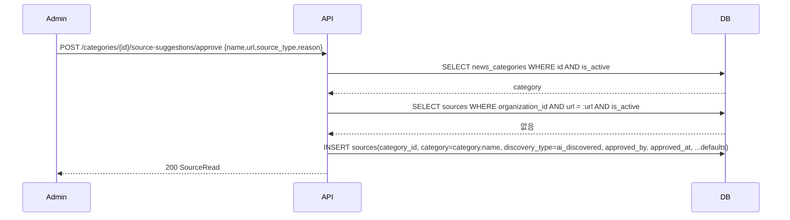
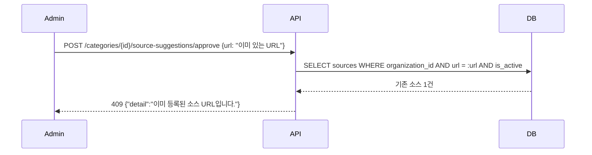

# 기술스펙_소스승인

- 기능요청: [#15](https://github.com/MEV-SW/mint-server/issues/15) / 인터페이스 정의: [API스펙_소스승인](API스펙_소스승인.md)([머지된 PR #24](https://github.com/MEV-SW/mint-server/pull/24))
- 작성: 채윤성 / 승인: 리뷰 없음(2026-09-06 규칙 — 본인이 PR을 올리고 본인이 머지)

## 변경 범위
- `app/schemas/source.py`: `SourceApproveRequest`(name/url/source_type 필수, reason 선택) 추가. `SourceRead`에 `approved_by: UUID | None`, `approved_at: datetime | None` 노출(기존 모델 컬럼은 있었으나 스키마에 없었음).
- `app/services/source_service.py`: `SourceService.approve_suggestion(organization_id, category_id, admin_id, data)` 추가 — 카테고리 존재·활성·조직 검증, URL 중복(409) 검증 후 `Source` 생성.
- `app/api/v1/personalization.py`: `POST /categories/{category_id}/source-suggestions/approve` 라우트 추가.
- 프론트(mint-web)·DB: 이 카드에서 변경 없음(웹은 W2에서 소비, 신규 테이블·마이그레이션 없음 — `approved_by`/`approved_at`은 P1 이전부터 있던 컬럼을 이제 채우기 시작할 뿐).

## DB 스키마 변경분
없음. `sources.approved_by`/`sources.approved_at`은 이미 존재하는 nullable 컬럼([001_init.py](https://github.com/MEV-SW/mint-server/blob/main/alembic/versions/001_init.py))이고, 이번에 처음으로 값을 채우는 코드가 생긴다.

## 핵심 흐름 (시퀀스 1-2개)

정상 경로:

실패 경로 — 이미 등록된 URL:

## 외부 의존성
없음. LLM 호출 없음 — 승인은 순수 DB 쓰기다. P2가 준 candidate 데이터를 클라이언트(W2)가 그대로 되돌려 보낸다는 전제(요청 본문 스키마가 P2 응답의 candidate 항목과 동일).

## flag
없음.
