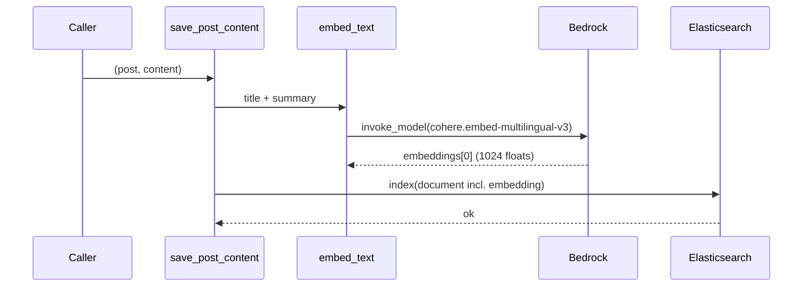
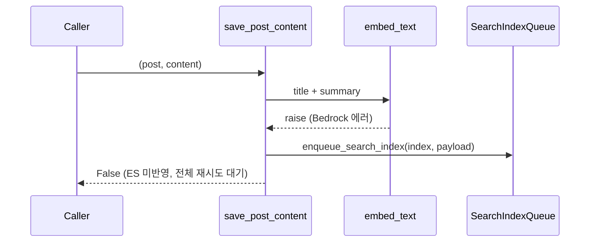

# API스펙_포스트임베딩색인

- 기능요청: [B0 임베딩 클라이언트 + posts 임베딩 색인](https://github.com/MEV-SW/mint-server/issues/28)
- 소속: [서버 기능묶음 #27](https://github.com/MEV-SW/mint-server/issues/27) / 프로젝트 [mint-release#9](https://github.com/MEV-SW/mint-release/issues/9)
- 새 REST 엔드포인트는 없다 — 기존 posts ES 색인 파이프라인에 임베딩 필드를 얹는 내부 변경.

## 전제

- 근거 실험: [B2 FINDINGS.md](https://github.com/MEV-SW/mint-server/blob/main/scripts/experiments/issue_clustering/FINDINGS.md). near-dup 코사인 0.90 / event 코사인 0.84 임계값 전제.
- 임베딩 모델: Amazon Bedrock `cohere.embed-multilingual-v3`, `us-east-1` 고정(이 모델은 해당 리전에만 있음. 리전 통합은 범위 밖).
- 기존 [`SearchIndexQueue`](https://github.com/MEV-SW/mint-server/blob/main/app/models/search_index_queue.py) 아웃박스와 [`save_post_content`](https://github.com/MEV-SW/mint-server/blob/main/app/search/post_content.py)를 그대로 재사용한다 — 별도 큐·워커를 새로 만들지 않는다.

## Elasticsearch 매핑 변경

`posts` 인덱스([`build_posts_index_body`](https://github.com/MEV-SW/mint-server/blob/main/app/search/index_mapping.py))에 필드 추가:

```json
"embedding": { "type": "dense_vector", "dims": 1024, "index": true, "similarity": "cosine" }
```

- `ensure_posts_index()`는 인덱스가 없을 때만 생성한다 — **이미 존재하는 운영 인덱스는 이 매핑을 자동으로 받지 않는다.** 운영 반영 시 인덱스 재생성 또는 `_reindex`가 별도로 필요하다(이 카드 범위 밖, 배포 절차에 기록).

## 임베딩 파이프라인 계약

입력: `title + "\n" + AI 요약`(요약이 아직 없으면 제목만). 대상 텍스트가 비어 있으면 임베딩을 호출하지 않고 `embedding: null`로 색인한다.

정상 경로:


실패 경로 — Bedrock 호출 실패(자격증명·쿼터·네트워크):


- 임베딩 실패는 문서 전체를 아웃박스에 다시 넣는다(부분 색인 없음) — 기존 아웃박스의 최대 8회 재시도·포기 정책을 그대로 물려받는다.
- 크롤·리라벨 등 기존 `save_post_content`/`sync_post_metadata` 호출부는 변경 없음 — 이 카드는 문서 빌더 내부에 필드 하나를 추가할 뿐, 호출 시그니처는 그대로다.

## 백필 스크립트

`scripts/backfill_post_embeddings.py --days 30 [--organization-id UUID]` — 최근 N일 posts를 `sync_post_metadata`로 재색인해 임베딩을 채운다. `SEARCH_BACKEND`가 `elasticsearch`/`dual`이 아니면 즉시 종료(1). 기존 [`backfill_recent_classification.py`](https://github.com/MEV-SW/mint-server/blob/main/scripts/backfill_recent_classification.py)와 같은 CLI 관례.

## 설정값

| 키 | 기본값 | 설명 |
|---|---|---|
| `BEDROCK_EMBEDDING_MODEL` | `cohere.embed-multilingual-v3` | |
| `BEDROCK_EMBEDDING_REGION` | `us-east-1` | 텍스트·이미지 모델과 리전이 다를 수 있어 분리(`BEDROCK_IMAGE_REGION`과 동일한 패턴) |
| `BEDROCK_EMBEDDING_DIMS` | `1024` | ES 매핑 `dims`와 반드시 일치해야 함 |
