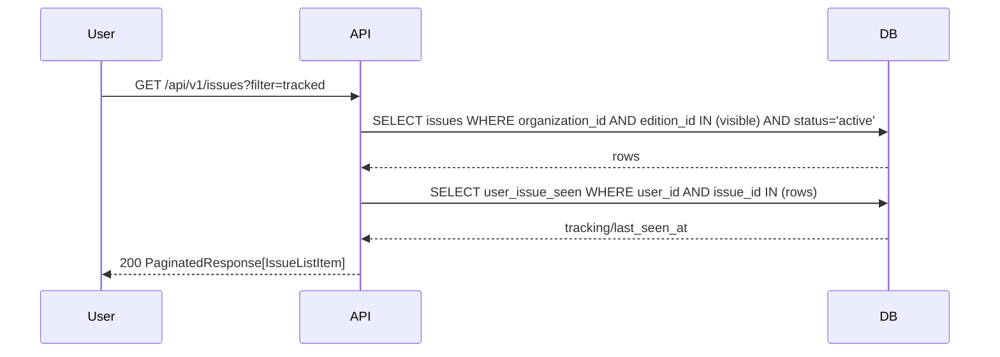
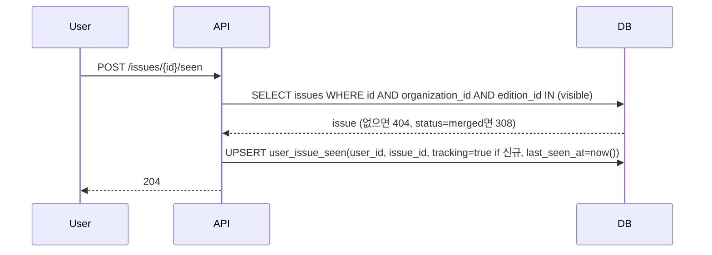

# 기술스펙_이슈데이터모델

- 기능요청: [B1](https://github.com/MEV-SW/mint-server/issues/29) / 인터페이스 정의: [API스펙_이슈데이터모델](API스펙_이슈데이터모델.md)([머지된 PR #35](https://github.com/MEV-SW/mint-server/pull/35))
- 작성: 채윤성 / 승인: 리뷰 없음(2026-09-06 규칙 — 본인이 PR을 올리고 본인이 머지)
- API스펙 문서가 필드·엔드포인트 계약을 이미 확정했으므로, 여기서는 그걸 실제 코드로 옮기는 파일 단위 변경 범위와 흐름만 적는다.

## 변경 범위

- `app/models/enums.py`: `IssueStatus`(`active`/`series`/`merged`), `MemberRole`(`origin`/`development`/`duplicate`), `ChangeKind`(`first_report`/`development`/`duplicates`/`correction`/`admin_adjust`), `FactType`(`fact`/`ai_interpretation`/`needs_check`) 추가.
- `app/models/issue.py` 신설: `Issue`, `IssueMember`, `IssueRevision`, `UserIssueSeen` — API스펙의 4개 저장 모델 그대로. 기존 [`app/models/personalization.py`](https://github.com/MEV-SW/mint-server/blob/main/app/models/personalization.py) 컨벤션(UUID PK, `organization_id`/FK, `created_at`/`updated_at` server_default) 따름.
- `app/schemas/issue.py` 신설: `IssueListItem`, `IssueRead`, `IssueMemberRead`, `IssueRevisionRead`, `IssueChangesResponse`, `TrackingUpdateRequest`/`Response` — API스펙 "상세" 절의 응답 예시 그대로.
- `app/services/issue_service.py` 신설: `IssueService` — 목록/상세/변화이력/변화피드/추적토글/seen 6개 쿼리. 조직·분야 공개 범위 필터(API스펙 "조직 공개 범위" 절)를 서비스 레이어 한 곳에 모아 목록·상세·근거·피드가 같은 필터 함수를 공유하게 한다(스펙의 "한 곳에서만 필터링하지 않는다" 요구를 "여러 곳에서 각자 필터링" 대신 "한 함수를 여러 곳이 호출"로 만족).
- `app/api/v1/issues.py` 신설: 엔드포인트 6개, 전부 `Depends(get_current_user)`.
- `app/api/v1/__init__.py`: `get_settings().issue_radar_enabled`일 때만 `api_router.include_router(issues.router, prefix="/issues", tags=["issues"])` — off면 라우터 자체가 안 붙어 404(API스펙 요구사항).
- `app/core/config.py`: `issue_radar_enabled: bool = False` 추가 (`personalization_enabled`와 동일 패턴).
- `alembic/versions/016_issue_radar.py` 신설: 4개 테이블 + 인덱스(`issues(organization_id,status,last_activity_at)`, `issue_member(issue_id,post_id)` unique, `issue_revision(issue_id,occurred_at)`, `user_issue_seen(user_id,issue_id)` unique). `down_revision = "015_source_category_id"`.
- 프론트(mint-web): 이 카드에서 변경 없음 — [W1](https://github.com/MEV-SW/mint-web/issues/28)이 이 계약을 소비.
- B0(임베딩 색인)·B4(배정)·B5(변화 분류)·B6(병합·분리 실행)은 각자 카드에서 구현. 이 카드는 저장 모델과 "엔드포인트가 존재하고 스텁이 계약대로 응답하는 수준"까지 — 즉 목록·상세·피드는 실제 쿼리로 동작하되, 데이터를 채우는 배정·분류 로직 자체는 없다(빈 테이블이면 빈 목록을 정확히 반환하는 정도).

## DB 스키마 변경분

새 테이블 4개(위 "변경 범위" 참고). 기존 테이블 변경 없음. `create_all`로도 생성되지만(로컬 개발), 운영은 `alembic upgrade head`로 `016_issue_radar` 적용.

## 핵심 흐름 (시퀀스 1-2개)

목록 조회 (추적·변화 여부 포함):

확인 커서 갱신 (상세 진입):

## 외부 의존성

없음(LLM·외부 API 호출 없음). B0가 만드는 임베딩/ES 인덱스에는 이 카드가 읽기로 의존하지 않는다 — `centroid_vector`는 ES 문서로 B0/B4가 관리하고, 이 카드의 6개 엔드포인트는 전부 RDB만 조회한다.

## flag

`ISSUE_RADAR_ENABLED` (기본 `false`). off면 라우터 미등록 → 전부 404. 기존 1면·뉴스·리포트·개인화 흐름은 이 값과 무관.
