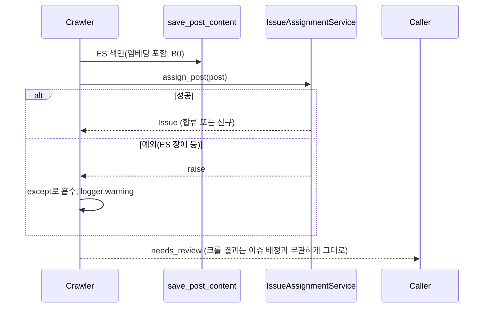

# 기술스펙_사건자동배정

- 기능요청: [B4](https://github.com/MEV-SW/mint-server/issues/31) / 인터페이스 정의: [API스펙_사건자동배정](API스펙_사건자동배정.md)
- 작성: 채윤성 / 승인: 리뷰 없음(§3 — 단독 리포, 승인 상대 없음)

## 변경 범위

- `app/core/config.py`: `issue_near_dup_cosine`(0.90)·`issue_event_cosine`(0.84)·`issue_window_days`(7) 추가. 전부 PROVISIONAL로 주석 표시.
- `app/search/post_search.py`: `get_post_embedding(post_id)` — ES 문서에서 `embedding` 필드만 조회. `knn_similar_post_ids(org, post_id, embedding, since, until, k)` — ES `knn` 쿼리, 자기 자신·타 조직·시간창 밖·숨김/삭제 제외.
- `app/services/issue_service.py`: `_recount`를 모듈 함수 `recount_issue(db, issue)`로 추출(동작 동일, B4가 재사용).
- `app/services/issue_assignment_service.py` 신설: `IssueAssignmentService.assign_post(post) -> Issue | None`. flag off·embedding 없음·후보 없음이면 조용히 `None`. 매칭 시 합류(`_join_issue`), 미매칭 시 신규 생성(`_create_issue`).
- `app/services/crawler_service.py`: `_attach_discovery_ai_output`의 `save_post_content` 호출 뒤에 `IssueAssignmentService(self.db).assign_post(post)` 추가, **전체를 `try/except`로 감싸 실패해도 크롤은 계속됨**(이슈 레이더는 부가 기능, 크롤이 핵심).

## DB 스키마 변경분

없음 — B1 테이블(`issues`/`issue_members`/`issue_revisions`) 그대로 씀.

## 핵심 흐름 (시퀀스 1-2개)

API스펙의 "배정 로직" 절이 이미 단계별로 있어 반복하지 않는다. 여기서는 실패 격리만:

## 외부 의존성

[B0](https://github.com/MEV-SW/mint-server/issues/28)(임베딩, 머지됨)·[B1](https://github.com/MEV-SW/mint-server/issues/29)(모델, 머지됨)에 의존. Elasticsearch가 꺼져 있으면(`SEARCH_BACKEND=postgres`, 기본값) `get_post_embedding`이 `None`을 반환해 배정이 전부 스킵된다 — 크롤 자체는 영향 없음.

## 검증

로컬 ES/Bedrock 없이, `get_post_embedding`/`knn_similar_post_ids`를 모킹해 SQLite로 직접 실행:
- 후보 없음 → 신규 이슈(member_count=1)
- 동일 출처 근접중복(cosine 0.95) → 기존 이슈 합류, `role=duplicate`, `source_count` 불변
- 타 출처 event-level(cosine 0.87) → 합류하되 `role=development`, `source_count` 증가 → 시리즈 가드 안 걸림 확인
- 동일 출처만 3건 누적(cosine 0.97) → 3번째에서 `status=series`로 전환 확인
- `ISSUE_RADAR_ENABLED=false` → `None` 반환, DB 변경 없음 확인
- 기존 `tests/test_crawl_progress.py` 재실행 — 회귀 없음 확인(기본 flag off라 크롤 흐름 자체는 변경 없음)

## flag

`ISSUE_RADAR_ENABLED` 재사용(읽기 API와 동일 스위치) — 별도 flag를 안 둔 이유는 "이슈 레이더 기능 전체가 하나의 스위치"가 더 이해하기 쉽고, 쓰기(배정)만 켜고 읽기(API)만 끄는 조합을 실제로 쓸 이유가 없어서다.
