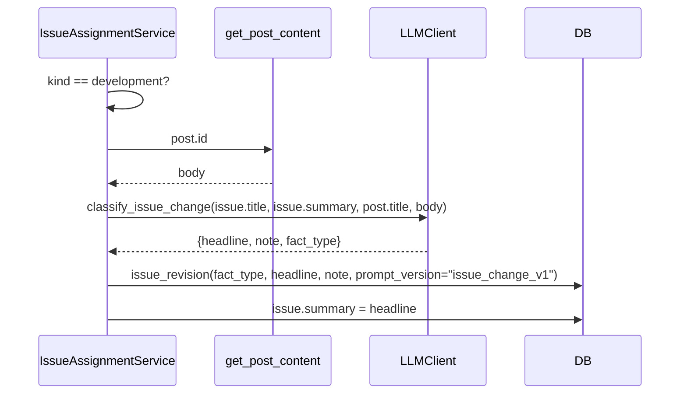
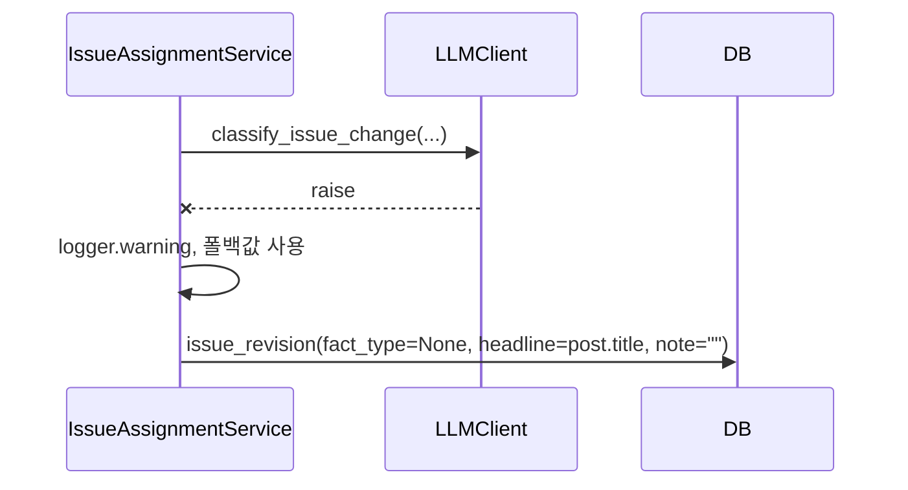

# 기술스펙_변화분류

- 기능요청: [B5](https://github.com/MEV-SW/mint-server/issues/32) / 인터페이스 정의: [API스펙_변화분류](API스펙_변화분류.md)
- 작성: 채윤성 / 승인: 리뷰 없음(§3 — 단독 리포, 승인 상대 없음)

## 변경 범위

- `app/prompts/issue_change_classify_v1.md` 신설.
- `app/services/llm_client.py`: `LLMClient.classify_issue_change(issue_title, issue_summary, new_title, new_body) -> dict` 추상 메서드 추가, `BedrockClient`/`GeminiClient`/`MockLLMClient` 세 곳에 구현(기존 `suggest_sources` 옆). `_issue_change_user()` 헬퍼로 JSON payload 구성.
- `app/services/issue_assignment_service.py`: `_join_issue`에서 `kind == development`일 때만 `_classify_change(post, issue)` 호출 — [`get_post_content`](https://github.com/MEV-SW/mint-server/blob/main/app/search/post_content.py)로 새 기사 본문을 가져와 LLM에 넘기고, 결과로 `headline`/`note`/`fact_type`을 `issue_revision`에 쓰고 `issue.summary`도 갱신. 실패 시 `post.title`/빈 note/`fact_type=None`으로 폴백(예외를 삼킴 — B4의 배정 자체는 건드리지 않음).

## DB 스키마 변경분

없음 — B1의 `issue_revision.fact_type`/`prompt_version`/`note` 컬럼을 이제 처음으로 채워 쓴다.

## 핵심 흐름 (시퀀스 1-2개)

정상 경로:

실패 경로:

## 외부 의존성

`get_llm_client()`(기존 팩토리, Bedrock/Gemini/Mock 자동 선택)에 의존. B4와 동일하게 크롤 훅 안에서 돌아 별도 인프라 의존성은 추가되지 않는다.

## 검증

Mock LLM으로 SQLite 직접 실행: (1) duplicates 배정은 AI 호출 자체가 안 일어남(headline=post.title, fact_type=None) 확인, (2) development 배정은 AI 호출이 일어나 fact_type이 채워지고 issue.summary가 갱신됨 확인, (3) LLM이 예외를 던져도 배정은 정상 완료되고 폴백값이 저장됨 확인. 기존 회귀 스위트 재실행 — 변화 없음(사전 존재하던 `test_search_index_outbox` 실패 2건 그대로, 무관).

## flag

없음 — `ISSUE_RADAR_ENABLED`가 B4를 통해 이미 게이트.
