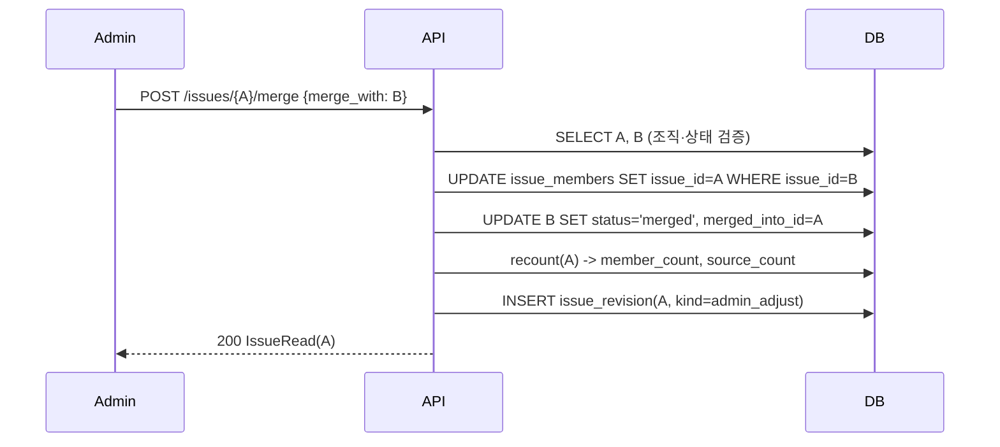
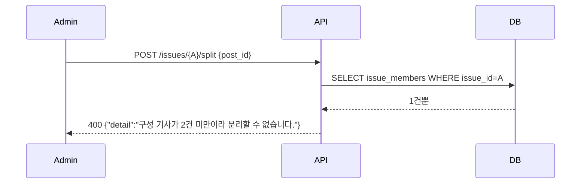

# 기술스펙_이슈병합분리

- 기능요청: [B6](https://github.com/MEV-SW/mint-server/issues/33) / 인터페이스 정의: [API스펙_이슈병합분리](API스펙_이슈병합분리.md)
- 작성: 채윤성 / 승인: 리뷰 없음(§3 — 단독 리포, 승인 상대 없음)

## 변경 범위

- `app/services/issue_service.py`: `IssueService`에 `merge_issue(user, issue_id, merge_with)`·`split_issue(user, issue_id, post_id)` 추가. 공통 재계산 헬퍼 `_recount(issue)` — `issue_member`를 다시 세어 `member_count`/`source_count`(구성 기사의 서로 다른 `post.source_id` 수)를 갱신.
- `app/api/v1/issues.py`: `POST /{issue_id}/merge`, `POST /{issue_id}/split` 추가. 둘 다 `Depends(require_admin)` — 나머지 6개 조회 엔드포인트의 `get_current_user`보다 좁은 권한.
- `app/schemas/issue.py`: `IssueMergeRequest{merge_with: UUID}`, `IssueSplitRequest{post_id: UUID}` 추가.
- 프론트·DB 스키마: 이 카드에서 변경 없음(B1 테이블 그대로 사용).

## DB 스키마 변경분

없음.

## 핵심 흐름 (시퀀스 1-2개)

병합:

분리 — 구성 기사 2건 미만:

## 외부 의존성

없음.

## 검증

TestClient로 실제 DB(SQLite) 시나리오 실행 예정: 이슈 A(기사 2건)·B(기사 1건) 생성 → 병합 → A가 기사 3건 갖고 B는 `merged`+308 리다이렉트 확인 → A에서 기사 1건 분리 → 새 이슈 C 생성, A는 기사 2건으로 감소, C에 `first_report` revision 확인 → A에 남은 기사 1건으로 재분리 시도 시 400 확인.

## flag

없음. 기존 `ISSUE_RADAR_ENABLED`가 라우터 전체를 이미 게이팅한다.
