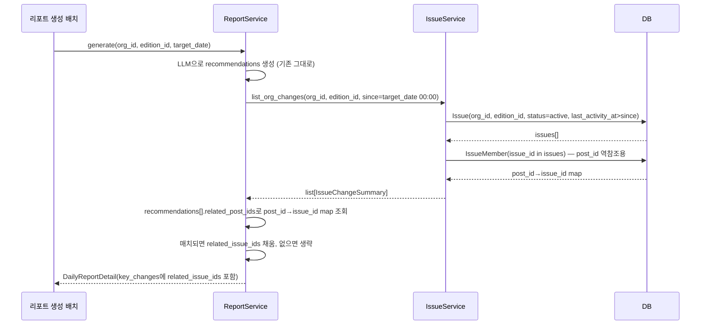
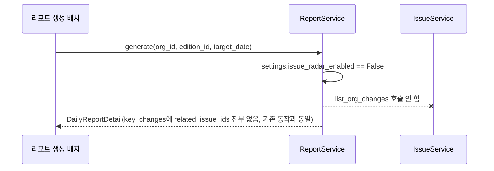

# 기술스펙_추적변화피드

- 기능요청: [#34](https://github.com/MEV-SW/mint-server/issues/34) / 인터페이스 정의: [API스펙_추적변화피드.md](API스펙_추적변화피드.md)
- 작성: yschae0311 / 승인: 리뷰 없음(§2, 2026-09-06 결정 · 솔로 담당 프로젝트)

## 변경 범위

- `app/services/issue_service.py` — `list_org_changes` 메서드 추가(신규 내부 API, HTTP 엔드포인트 아님)
- `app/services/report_service.py` — `_normalize_report_result`에서 `related_issue_ids` 채우는 로직 추가
- `app/schemas/report.py` — `key_changes` 항목에 `related_issue_ids: list[UUID] | None` 필드 추가
- 프론트(mint-web) — 변경 없음. 1면 변화 밴드는 기존 `GET /issues/changes` 그대로 사용
- DB — 변경 없음

## DB 스키마 변경분

없음. 기존 `Issue`·`IssueMember`·`IssueRevision` 테이블만 조회한다.

## 인터페이스 정의 이후 확정한 설계 결정

API스펙 작성 시점엔 "조직 전체 공개범위를 에디션 `visibility` 플래그로 판단"하는 방향을 열어뒀는데, 구현 착수하며 보니 그 플래그가 모델에 없고 새로 만들 이유도 없었다.
`DailyReport`는 이미 `edition_id`로 스코프가 잡혀 있어([`report_service.py:39-48`](https://github.com/MEV-SW/mint-server/blob/main/app/services/report_service.py#L39-L48)) 리포트 하나가 곧 에디션 하나(또는 org 전체 `edition_id=None`)다. 그래서 `list_org_changes`가 조직 전체를 훑을 필요 없이 **그 리포트가 속한 에디션으로만 필터**하면 된다 — 기존 `list_issues`의 `edition_id` 파라미터와 동일한 방식. 새 visibility 개념을 안 만든다.

## 핵심 흐름

### 정상 경로 — 리포트 생성이 이슈 변화를 흡수

### 실패 경로 — issue_radar_enabled 꺼짐

## 구현 메모

- `list_org_changes(organization_id, edition_id, since) -> list[IssueChangeSummary]`
  - 쿼리: `Issue.organization_id == organization_id, Issue.edition_id == edition_id (None 이면 IS NULL), Issue.status == active, Issue.last_activity_at > since`. `_base_query`와 같은 `merged`/`series` 제외 규칙 재사용.
  - `IssueChangeSummary = { issue_id, title, last_change_kind, top_revision_kinds[:3] }` — `list_changes`의 개인화 필드(`tracking`/`has_unseen_change`) 없이 순수 이슈 정보만.
- `_normalize_report_result`: `list_org_changes` 결과로 `post_id -> issue_id` 맵을 만들고, 각 `key_changes` 항목의 `related_post_ids`를 순회해 매치되는 `issue_id`를 `related_issue_ids`에 채운다. LLM 결과 자체는 안 바꾼다 — 이슈 참조만 덧붙인다.
- `settings.issue_radar_enabled`가 꺼져 있으면 `list_org_changes`를 호출하지 않는다 — 오늘 배포본과 완전히 같은 동작 보장.

## 외부 의존성

없음. 기존 서비스 간 호출만 추가한다.

## flag

- 신규 flag 없음. 기존 `issue_radar_enabled`(기본 `false`, 운영 `true`)가 이 통합 전체를 감싼다.
